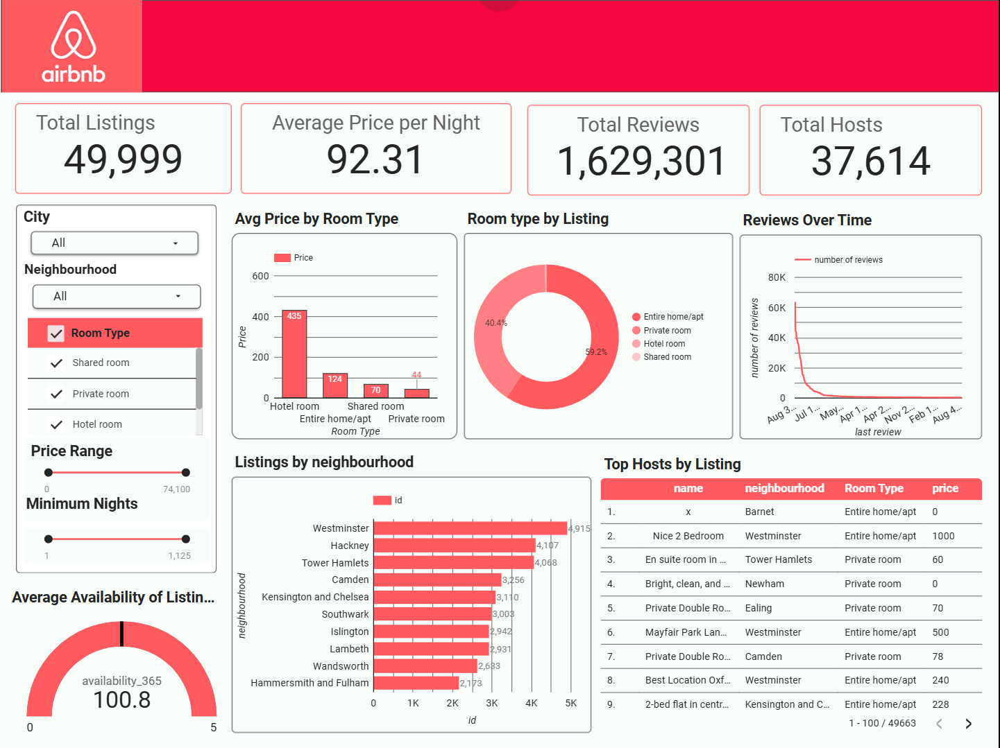

#  Airbnb Listings Dashboard 

An interactive data visualization project built using Looker Studio to analyze Airbnb listings, pricing strategies, host activity, and neighbourhood trends.

---

##  Project Overview

This project transforms raw Airbnb listing data into an interactive dashboard to uncover:

- Pricing trends across room types  
- Neighbourhood-level demand patterns  
- Host activity and listing distribution  
- Review and availability insights  

---

##  Dataset Information

- File Name: `airbnb_listings.csv`  
- Total Records: 49,999  
- Primary Key: `listing_id`  

---

##  Data Dictionary

| Column Name        | Description                  |
|-------------------|------------------------------|
| listing_id        | Unique listing ID            |
| neighbourhood     | Listing location             |
| room_type         | Type of room                 |
| price             | Price per night              |
| minimum_nights    | Minimum stay requirement     |
| availability_365  | Days available per year      |
| number_of_reviews | Total reviews received       |
| last_review       | Most recent review date      |
| host_id           | Unique host ID               |
| host_name         | Host name                   |

---

##  Key Insights

###  Listings Overview
- Total Listings: 49,999  
- Total Hosts: 37,614  
- Total Reviews: 1,629,301  

---

###  Room Type Distribution
- Entire home/apt: ~59%  
- Private room: ~40%  
- Shared/Hotel room: <1%  

---

###  Pricing Insights

| Room Type        | Avg Price |
|------------------|----------|
| Hotel room       | ~$435    |
| Entire home/apt  | ~$124    |
| Shared room      | ~$70     |
| Private room     | ~$44     |

Insight: Hotel rooms have significantly higher pricing but represent a very small portion of listings, which may skew averages.

---

###  Top Neighbourhoods (by Listings)

- Westminster: 4,915  
- Hackney: 4,107  
- Tower Hamlets: 4,048  
- Camden: 3,456  
- Kensington & Chelsea: 3,110  

Insight: Listings are concentrated in central boroughs, indicating high demand and competition.

---

##  Dashboard Features

### Interactive Filters
- Neighbourhood  
- Room Type  
- Price Range  
- Availability  

### Visualizations
- Bar chart: Listings by neighbourhood  
- Pie chart: Room type distribution  
- Scorecards: KPIs (Listings, Avg Price, Reviews)  
- Time series: Reviews over time  
- Table: Host-level insights  

---

##  Data Cleaning

- Removed duplicate `listing_id`  
- Handled missing values in `last_review`  
- Standardized categorical fields  
- Converted numeric columns (price, availability)  
- Filtered extreme outliers  

---

##  Tools Used

- Looker Studio  
- Google Sheets  
- Python (optional for preprocessing)  

---

##  How to Use

1. Upload dataset to Google Sheets  
2. Connect it to Looker Studio  
3. Create a report  
4. Add charts and filters  
5. Customize layout and styling  

---

##  Use Cases

- Market trend analysis  
- Pricing strategy optimization  
- Host performance tracking  
- Data analytics portfolio project  

---

##  Dashboard Preview

---

##  Future Improvements

- Add calculated fields (Demand Score, Revenue Estimate)  
- Build predictive pricing model  
- Add geospatial maps (latitude/longitude)  
- Perform seasonal trend analysis  

---

##  Key Takeaways

- Pricing varies significantly by room type and location  
- Central neighbourhoods dominate listing volume  
- A small number of listings can skew average prices  
- Review activity can be used as a proxy for demand  

---

